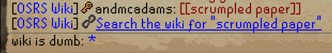

# GloopyLite
Implements a basic [GloopyBot](https://github.com/weirdgloop/gloopybot )-like interface for creating links to wiki pages in the chatbox.

In order to use the plugin, simply type a message with whatever you want to search in `[[square brackets]]`. This will cause a message to appear for those with the plugin that will take them to the wiki page once clicked. When other people send messages with `[[square brackets]]` it will also generate a link for you.

Don't want to accidentally click the link? Turn on control-click in the plugin settings instead.

This is a much simpler implementation than the original GloopyBot and lacks support for searching wikis other than the Old School RuneScape wiki.

